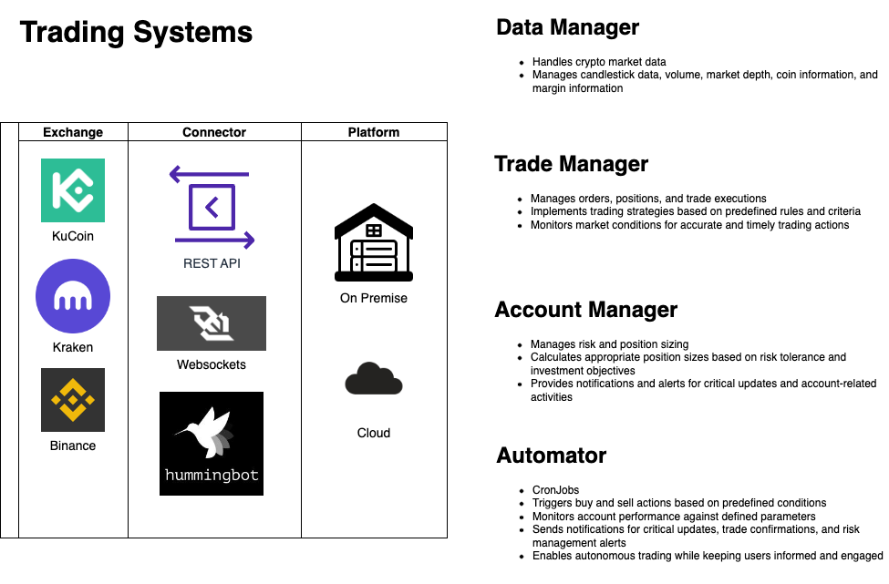
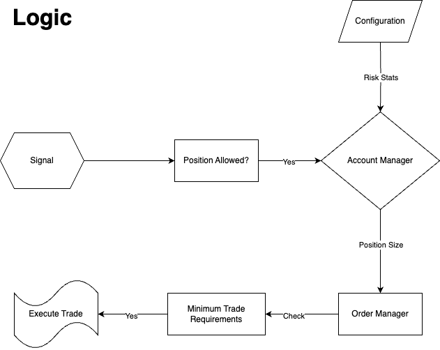

The trading systems are designed for the following exchanges:
1. Kraken
2. Kucoin
3. Binance

Each system is comprised of multiple managers:
1. Data Manager
2. Trade Manager
3. Account Manager
4. Automator

# Data Manager:
The Data Manager is an integral component of the automated crypto trading system, responsible for handling a wide range of crucial market data. It efficiently collects, processes, and manages various data types such as candlestick data, volume information, market depth, coin details, and margin information. By continuously monitoring and analyzing these datasets, the Data Manager provides the necessary insights and inputs required for effective trading decisions.

# Trade Manager:
The Trade Manager is a powerful module designed to streamline the trading process within the automated crypto trading system. It encompasses a range of functionalities, including order management, position tracking, and trade execution. This component executes trading strategies based on predefined rules and criteria, ensuring accurate and timely implementation of buy and sell orders. The Trade Manager constantly monitors the market conditions and takes appropriate actions to optimize trading performance.

# Account Manager:
The Account Manager plays a vital role in overseeing risk management and position sizing within the automated crypto trading system. It ensures that the trading strategies align with the defined risk tolerance and investment objectives. This module calculates and manages the appropriate position sizes for each trade, considering factors such as account balance, risk-reward ratios, and market volatility. Additionally, the Account Manager provides notifications and alerts to keep users informed about critical updates, potential risks, and account-related activities.

# Automator
The Automator is a vital component of the automated crypto trading system, serving as an on-premise service similar to crontab. It functions as a systematic routine that triggers buy and sell actions based on predefined conditions and trading strategies. By adhering to these predefined rules, the Automator ensures that trades are executed accurately and efficiently. Moreover, it actively monitors the trading account, continuously assessing its performance against defined parameters and objectives. In addition to its trading functions, the Automator also acts as a notification system. It intelligently identifies event triggers and sends out notifications to keep users informed and updated about critical updates, trade execution confirmations, risk management alerts, and other significant account-related information. The presence of the Automator within the automated crypto trading system enables it to function as a self-contained and highly efficient solution, allowing for autonomous trading while ensuring users remain engaged and informed throughout the process.

# Overview

Overall, this comprehensive automated crypto trading system per exchange combines the Data Manager, Trade Manager, and Account Manager to create a sophisticated and efficient trading environment. It leverages accurate market data, executes trades seamlessly, and manages risk effectively, enabling users to make informed trading decisions and maximize their potential returns in the dynamic cryptocurrency market.